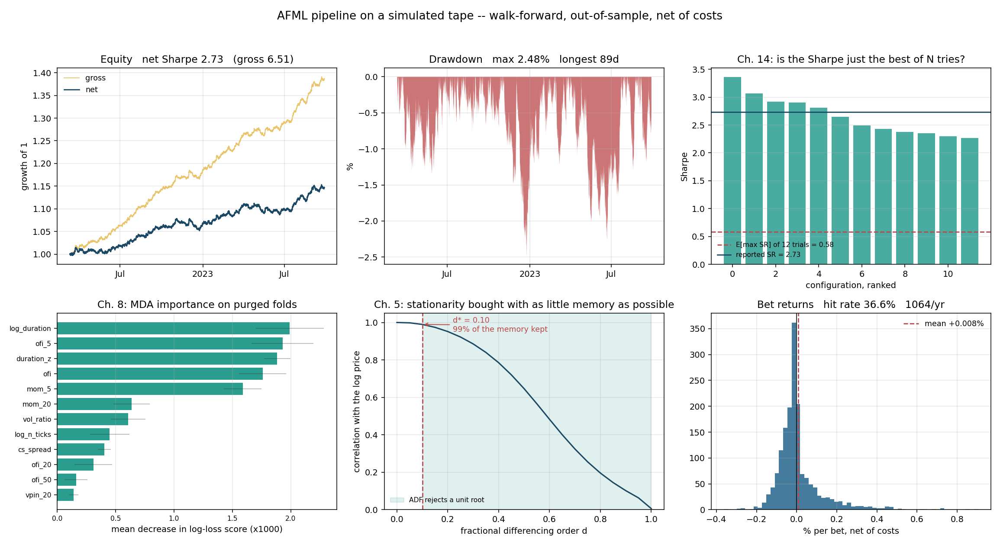

# afml-lab — a systematic trading pipeline after López de Prado

An implementation, from scratch, of the machine-learning workflow in Marcos López de
Prado's *Advances in Financial Machine Learning* (Wiley, 2018): information-driven
bars, triple-barrier labelling, meta-labelling, sample uniqueness, purged
cross-validation with an embargo, MDI/MDA/SFI feature importance, bet sizing, and a
walk-forward backtest closed out by a deflated Sharpe ratio.

Every stage is written against the book's own snippets, and every stage is tested
against something that can actually be checked — a hand-computed example, a closed-form
identity, or a simulator whose parameters are known.

---

## Why the data is simulated

The book's methods are defined on **ticks**: the tick rule, imbalance bars, Roll's
spread and Kyle's lambda are all statements about individual trades. Free daily OHLC
would make most of the pipeline decorative.

So the input is a trade tape from a structural model whose parameters are known
(`afml/data/synthetic.py`): a persistent latent information process drives both order
flow and the drift of an efficient price, Kyle-style permanent impact enters through
signed root-volume, a bid-ask bounce is added on top, and trades arrive at
information-dependent Poisson times. The defaults produce ~1000 days of tape at
~24% annualised volatility, a 5bp spread, and an 80% tick-rule hit rate.

This buys something real data cannot: **the estimators can be graded**. The test suite
asserts that Roll's estimator recovers the true spread to within 2% when its assumptions
hold, that it converges to `s·(1−ρ)` under order-flow autocorrelation, and that it is
inflated by `√(1 + 2λ·E[√V]/s)` when permanent impact is present. Those are the
estimators' known biases, derived and then measured rather than hoped away.

The Sharpe ratio below is therefore a property of the generator, not a claim about
markets. What transfers is the machinery.

---

## Results

Walk-forward, out-of-sample, net of a 3bp cost per unit of turnover, on ~1.5 years of
held-out tape (`python scripts/run_pipeline.py`):

| | |
|---|---|
| Net Sharpe (gross) | **2.73** (6.51) |
| CAGR / annualised vol | 9.2% / 3.3% |
| Max drawdown / longest underwater | 2.5% / 89 days |
| Bets per year / hit rate | 1,064 / 36.6% |
| PSR, `P[SR > 0]` | 0.9997 |
| **DSR** after 12 configurations tried | **0.9963** |
| Realised precision vs. precision implied by SR=1 | 0.366 vs 0.328 |

A 36.6% hit rate with a positive Sharpe is the triple barrier working as designed:
profit-taking barriers are hit less often than stops but the vertical barrier converts
many would-be losses into small ones, so the payoff is asymmetric. The deflated Sharpe
is the honest headline — the plain Sharpe is the best of twelve configurations, and
`E[max SR]` under the null for twelve trials with `sd(SR)=0.35` is 0.58.



### Three findings worth reading off the run

**Fractional differencing gets stationarity almost for free.** The minimum `d` passing
an ADF test at 5% is **0.10**, and that series still has a **0.99** correlation with the
log price. Plain returns (`d=1`) retain 0.006. The memory that momentum and
mean-reversion signals live on is thrown away by first differencing for no statistical
gain (Ch. 5).

**Contamination scales with the label span, and purging removes all of it.** A
deterministic audit — no model, no randomness — counts how many training labels reach
into the test fold under naive 5-fold:

| label span | naive 5-fold | purged + 1% embargo |
|---:|---:|---:|
| 12h | 61 (0.12%) | 0 |
| 48h | 219 (0.43%) | 0 |
| 120h | 522 (1.02%) | 0 |
| 480h | 2,104 (4.19%) | 0 |
| 1440h | 6,312 (13.13%) | 0 |

The rate is roughly `1.6 × (label span / fold span)` — 1.6 fold boundaries per fold on
average across five folds. For the 12-hour barriers traded here it is negligible, and
the measured score gap between naive and purged k-fold is correspondingly ~0.0000
accuracy. For the multi-week barriers a daily strategy uses it is 4–13% of the training
set. Reporting the audit rather than assuming a leak is the point: the contamination
rate is a property of the label geometry alone, while whether a *model* converts it into
optimism also depends on that model's capacity to memorise.

**The three importance measures disagree in the way the book predicts.** On planted
ground truth (`make_test_data`: 4 informative, 4 redundant copies, 12 noise), MDI and MDA
split credit between the informative columns and their substitutes, while SFI — which
fits one feature at a time — ranks a redundant copy as highly as the original. All three
give the noise columns nothing. These are assertions in `tests/test_importance.py`, not
illustrations.

---

## Layout

```
afml/
  data/synthetic.py    Ch. 2   tick simulator with known microstructure truth
  bars.py              Ch. 2   tick/volume/dollar bars, imbalance bars, run bars
  fracdiff.py          Ch. 5   FFD weights, expanding and fixed-width, min-d search
  features/            Ch. 19  feature matrix; Roll, Corwin-Schultz, Kyle,
                               Amihud, Hasbrouck, VPIN, order-flow imbalance
  labeling.py          Ch. 3   CUSUM filter, triple barrier, meta-labelling
  sampling.py          Ch. 4   concurrency, uniqueness, sequential bootstrap, weights
  cv.py                Ch. 7   purged k-fold, embargo, walk-forward, overlap audit
  importance.py        Ch. 8   MDI, MDA, SFI, orthogonal features, planted-truth data
  bet_sizing.py        Ch. 10  probability -> size -> averaged over active bets
  backtest.py          Ch. 14  event-driven backtest with a cost model
  stats.py         Ch. 14, 15  PSR, DSR, drawdown, HHI, implied precision, prob. failure
  multiprocess.py      Ch. 20  the job engine every heavy loop runs on
scripts/run_pipeline.py        the ten stages, end to end
tests/                         104 tests
```

## Quickstart

```bash
pip install -r requirements.txt

python scripts/run_pipeline.py --outdir results   # full run, ~12 min on 2 cores
python scripts/run_pipeline.py --quick            # 1M ticks, no sweep, ~2 min
python -m pytest -q                               # 104 tests, ~1 min
```

Artefacts land in `results/`: `report.png`, `performance.csv`, `feature_importance.csv`,
`overlap_audit.csv`, `cv_comparison.csv`, `fracdiff_adf.csv`, `equity_curve.csv`,
`bet_returns.csv`, and `run.json` (full configuration, trial Sharpes, runtime).

Using it as a library:

```python
from afml import bars, labeling as L, sampling as W
from afml.cv import PurgedKFold, cv_score
from afml.features import build_features

bars_df = bars.dollar_bars(ticks, threshold=1e6)
X       = build_features(bars_df, ticks, d_ffd=0.10)

vol      = L.get_vol(bars_df["close"], span=100, horizon=pd.Timedelta(hours=4))
t_events = L.cusum_filter(bars_df["close"], vol * 0.5)
t1       = L.add_vertical_barrier(t_events, bars_df["close"], pd.Timedelta(hours=12))
events   = L.get_events(bars_df["close"], t_events, (1., 1.), vol, t1=t1, side=side)
labels   = L.get_bins(events, bars_df["close"], min_ret=6e-4)

co = W.get_num_co_events(bars_df.index, events["t1"])
w  = W.sample_weights(events["t1"], co, bars_df["close"])

scores = cv_score(clf, X, labels["bin"], w, "neg_log_loss",
                  t1=events["t1"], cv=5, pct_embargo=0.01)
```

---

## The ten stages

1. **Ticks.** Simulated tape; ground-truth spread, impact and order-flow persistence retained for the tests.
2. **Bars.** Dollar bars at ~50/day. Their returns have lower excess kurtosis (+0.46) than hourly time bars (+0.77), which is the property §2.4 claims for activity-based sampling.
3. **Stationarity.** `min_ffd` sweeps `d`, runs ADF on each fixed-width series and returns the smallest order that rejects a unit root.
4. **Features.** 29 columns: fractionally differenced price level, risk-adjusted momentum, order-flow imbalance at three horizons, bar-clock activity, and the Chapter 19 estimators.
5. **Events.** CUSUM sampling on a volatility-scaled threshold, then the triple barrier: 87% of events end on a horizontal barrier, 13% on the vertical one, median holding 4.4 hours.
6. **Weights.** Concurrency (mean 3.3 labels open at once), average uniqueness (0.31), return attribution, and time decay, multiplied into one weight per observation and normalised to mean 1.
7. **Leakage.** The overlap audit and the naive-vs-purged score comparison above.
8. **Importance.** MDI, MDA and SFI on purged folds, ranked by MDA.
9. **Backtest.** Six expanding walk-forward folds, positions from the meta-model's probability on a 0.05 grid, costs charged on turnover.
10. **Risk.** PSR, a 12-configuration sweep, the deflated Sharpe against `E[max SR]` from that sweep, and the Chapter 15 implied-precision check.

### The primary model is a rule, on purpose

Meta-labelling needs something that already picks a side. Here that is an explicit rule —
`side = sign(5-bar order-flow imbalance)` — not a second classifier. Two reasons: it keeps
the division of labour legible (the rule owns recall, the classifier owns precision, and
the classifier can size a bet to zero but never reverse it), and it avoids the trap of a
primary model whose in-sample predictions become the secondary model's features.

---

## Deviations from the book, and why

The book's snippets are pseudocode written for exposition. Six places needed a decision:

**Imbalance bars have no interior fixed point.** The threshold is *linear* in `E₀[T]`
while a balanced-flow imbalance grows like `√T`, so a stretch of two-sided flow makes
bars longer, which raises the threshold, which makes them longer still — until one bar
swallows the sample. `min_ticks_per_bar` / `max_ticks_per_bar` clamp `E₀[T]`; the
sampler is untouched in the informative regime the bars exist to capture.

**Snippet 8.7 leaves the rows sorted by class.** `make_classification(shuffle=False)`
keeps the informative columns first — which is what the book wants — but it also leaves
the samples ordered by label. Combined with the contiguous test folds of `PurgedKFold`,
every fold then contains a single class: MDA collapses to zero and SFI ranks noise above
signal. The rows are shuffled explicitly here.

**Microstructure estimators belong on ticks, not on bars.** Roll's estimator inverts the
autocovariance the bid-ask bounce injects; aggregate to bar closes and the bounce is gone
while drift dominates, so the estimate floors at zero more than 40% of the time (asserted
in the tests). `features/tick_stats.py` keeps the estimators on the tape and puts only
the *aggregation* on the bar clock: each estimator is a ratio of sums over ticks, so
per-bar partial sums are sufficient statistics, and rolling those gives every window in
one pass over the ticks.

**The sequential bootstrap as written is O(n²·bars).** Snippet 4.5 recomputes every
candidate's average uniqueness after every draw, which is intractable past a few hundred
labels. But a triple-barrier label occupies a *contiguous* run of bars, so its average
uniqueness is a windowed mean of `1/(c+1)` and can be read off a prefix sum: O(bars) per
draw instead of O(n·bars). The book's loop is kept as `method="reference"` and the tests
assert the two agree exactly for a given seed.

**`min_ffd` compares different samples.** The fixed-width window grows quickly as `d`
falls — thousands of lags below `d=0.2` — so each grid point yields a series of a
different length. Comparing "memory retained" across them is comparing different samples,
and the column need not even be monotone in `d`. Here ADF uses each series in full (for
power) while the correlations are computed on the index they all share.

**Purged k-fold is for model selection, not for the headline.** Every fold after the
first is trained partly on the future. `PurgedWalkForward` — expanding window, purged at
the boundary, embargoed — produces the reported performance; `PurgedKFold` produces the
feature importances and the CV comparison, where using all the data out-of-sample is
what makes them stable.

---

## What this is not

- **Not a strategy.** The alpha is planted in the simulator. On real data the
  microstructure signal it imitates decays in minutes and competes with faster capital.
- **No CPCV or PBO.** Combinatorially purged CV (Ch. 12) and the probability of
  backtest overfitting are the natural next step; the deflated Sharpe here uses the
  variance of the twelve trial Sharpes actually run, which is the honest but weaker
  version.
- **A simple cost model.** Half-spread plus commission on turnover, with an optional
  square-root impact term that defaults off. No queue position, no partial fills, no
  borrow.
- **Single asset.** Chapter 16's allocation machinery (HRP) is not implemented.

## Tests

```
104 passed in 59s
```

They are written to fail if the implementation is wrong, not to confirm that it runs:

- `test_features.py` recomputes the whole feature matrix on a truncated history and
  requires bit-identical values at shared timestamps. Any centred window, full-sample
  scaling, or stray `shift(-k)` anywhere in the chain breaks it.
- `test_backtest.py` checks that a perfect-foresight signal scores above Sharpe 20 while
  the same signal shifted five bars into the past scores under 5 — if both look good, the
  engine is peeking.
- `test_sampling.py` reproduces the indicator matrix and the average uniqueness
  `{5/6, 3/4, 1}` of the worked example in Snippets 4.3–4.4.
- `test_stats.py` reproduces the book's implied precision of 0.5316 for symmetric 1%
  payouts at 250 bets a year targeting Sharpe 1.
- `test_microstructure.py` grades each estimator against the simulator's parameters,
  including the biases: Roll under order-flow autocorrelation, and Kyle's and Hasbrouck's
  lambdas contaminated by the spread when run on transaction rather than midquote prices.
- `test_cv.py` asserts that purging leaves *exactly zero* contaminated training labels
  where naive k-fold leaves more than 5%.

## Reference

Marcos López de Prado, *Advances in Financial Machine Learning*, Wiley, 2018.
Chapters 2–5, 7, 8, 10, 14, 15, 19, 20.
